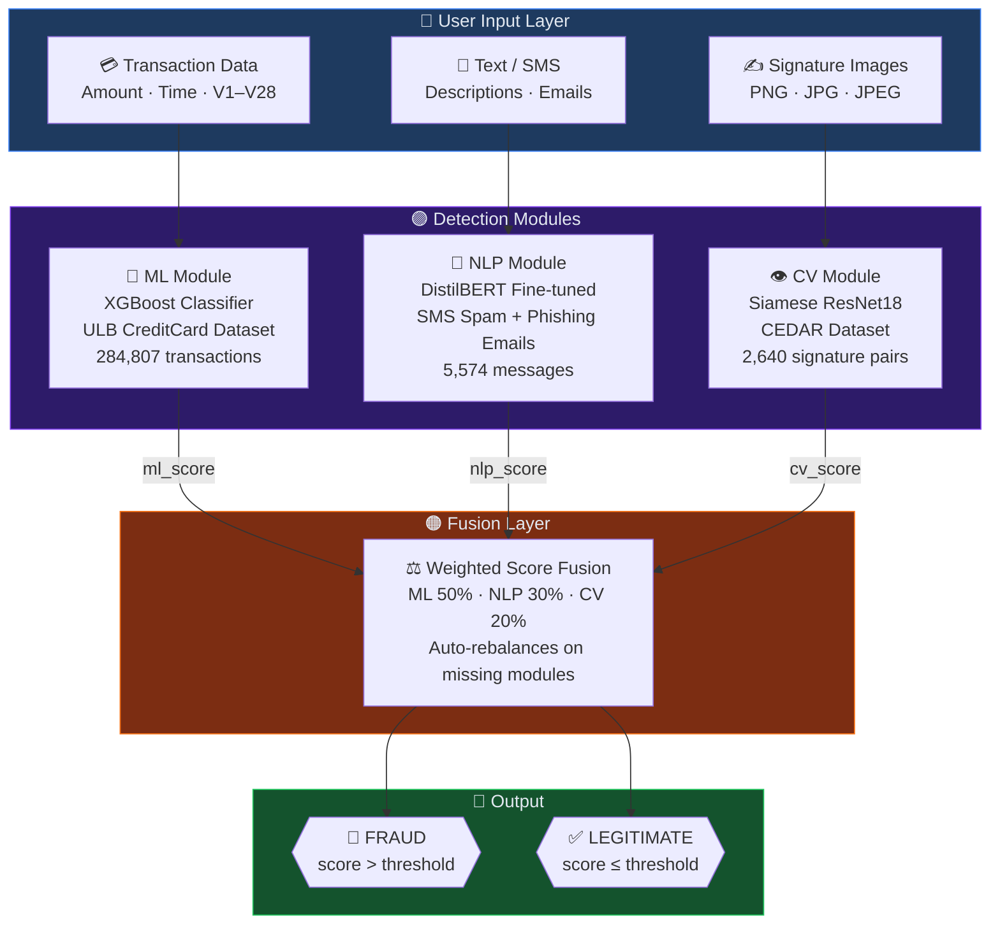
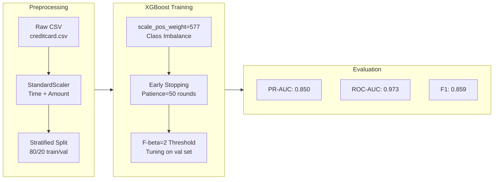
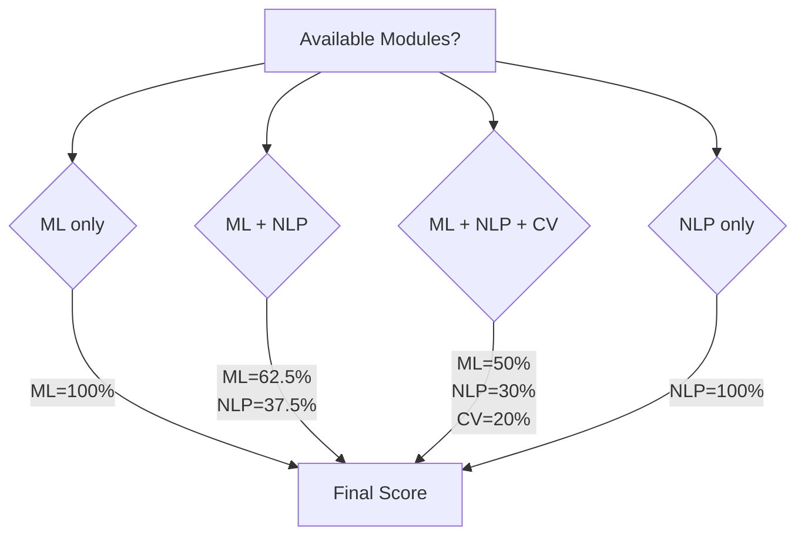
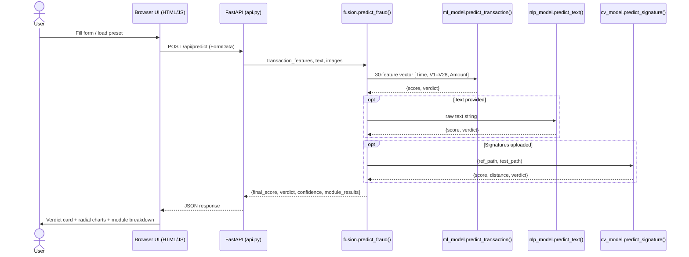
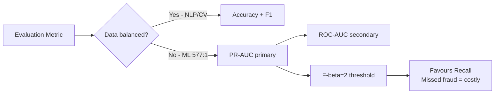

# 🛡️ AI-Powered Financial Fraud Detection System

<div align="center">


**Multi-modal financial fraud detection combining Machine Learning, Natural Language Processing,
and Computer Vision into a unified real-time analysis dashboard.**

Access it live on [this link](https://compact-brigitte-test-bot-fc0e52e5.koyeb.app/) 

[🚀 Quick Start](#️-quick-start) · [📦 Pre-trained Assets](#-pre-trained-assets-google-drive) · [🏗️ Architecture](#️-system-architecture) · [📊 Results](#-evaluation-results) · [🖥️ Dashboard](#️-fastapi-dashboard)

</div>

---

## 📦 Pre-trained Assets (Google Drive)

> **Fastest way to get started** — download the pre-trained models and sample data,
> then run the dashboard immediately without any training.

| Asset | Description | Download |
|-------|-------------|----------|
| 🤖 **Models** | XGBoost (`.ubj`), scaler, NLP weights, CV weights, metrics JSON | [⬇️ Download models.zip](https://drive.google.com/file/d/1m-82bqvhosy8sZCjXA3Q1F0mfRkDGMl_/view?usp=sharing) |
| 📊 **Data** | Processed datasets + raw CSVs for retraining | [⬇️ Download data.zip](https://drive.google.com/file/d/1HvfRSVkhHByEvrOvWt6-o50UlPYmW8PL/view?usp=sharing) |

### One-command Setup

```bash
# 1. Edit setup_assets.py — paste your Google Drive share URLs into DOWNLOADS dict
# 2. Run:
python setup_assets.py            # downloads both models + data
python setup_assets.py --models-only   # only models (enough to run the dashboard)
python setup_assets.py --data-only     # only data (for retraining)
```

The script auto-installs `gdown`, extracts the zips, and deletes them. ✅

---

## 🏗️ System Architecture

### High-Level Architecture



---

### ML Module — Internal Pipeline



---

### Fusion Weight Rebalancing



---

### Inference Workflow (Dashboard)




---

## 🔬 Detection Modules

### Module 1 — ML (XGBoost)

| Property | Value |
|----------|-------|
| **Algorithm** | XGBoost (gradient-boosted decision trees) |
| **Dataset** | ULB Machine Learning Group — 284,807 credit card transactions |
| **Class ratio** | 99.83% legitimate · 0.17% fraud (577:1 imbalance) |
| **Features** | Time, Amount, V1–V28 (PCA-anonymised transaction features) |
| **Imbalance strategy** | `scale_pos_weight=577` (no SMOTE — outperforms it by +8% PR-AUC) |
| **Threshold tuning** | F-beta=2 on validation set (favours recall over precision) |
| **Model file** | `models/xgboost_fraud.ubj` |
| **Scaler file** | `models/scaler.pkl` |

### Module 2 — NLP (DistilBERT)

| Property | Value |
|----------|-------|
| **Model** | `distilbert-base-uncased` fine-tuned |
| **Dataset** | UCI SMS Spam Collection + Phishing Email Corpus |
| **Training size** | 5,574 messages |
| **Fine-tuned layers** | Layers 3–5 (layers 0–2 frozen to preserve language knowledge) |
| **Detects** | Phishing URLs, urgent language, social engineering, suspicious domains |
| **Model folder** | `models/distilbert_fraud/` |

### Module 3 — CV (Siamese ResNet18)

| Property | Value |
|----------|-------|
| **Architecture** | Siamese network with shared ResNet18 backbone |
| **Dataset** | CEDAR Signature Verification (55 signers × 24 genuine + 24 forged) |
| **Training pairs** | 2,640 genuine/forged signature images |
| **Loss** | Contrastive loss — learns similarity, not classification |
| **Frozen layers** | `layer1`, `layer2` (ImageNet pretrained weights preserved) |
| **Model file** | `models/siamese_resnet18.pt` |

---

## 📁 Project Structure

```
AI-Fraud-Detection-System/
│
├── 📂 src/                             # Core ML pipeline
│   ├── data_preprocessing.py           # ULB loading, scaling, stratified split
│   ├── ml_model.py                     # XGBoost train + SHAP + threshold tuning
│   ├── nlp_model.py                    # DistilBERT fine-tuning + inference
│   ├── cv_model.py                     # Siamese ResNet18 train + inference
│   ├── fusion.py                       # Multi-modal weighted score combiner
│   └── utils.py                        # Logging, plotting, helpers
│
├── 📂 models/                          # Trained weights (git-ignored)
│   ├── xgboost_fraud.ubj               # XGBoost native binary (fast load)
│   ├── xgboost_fraud.pkl               # XGBoost pickle backup
│   ├── scaler.pkl                      # StandardScaler for Time + Amount
│   ├── ml_metrics.json                 # ROC-AUC, F1, PR-AUC, threshold
│   ├── distilbert_fraud/               # HuggingFace model + tokenizer folder
│   └── siamese_resnet18.pt             # Siamese ResNet18 weights
│
├── 📂 data/                            # Datasets (git-ignored)
│   ├── raw/
│   │   ├── creditcard.csv              # ULB fraud dataset (284k rows)
│   │   ├── spam.csv                    # SMS spam collection
│   │   ├── phishing_email.csv          # Phishing email corpus
│   │   └── signatures/                 # CEDAR signature images
│   └── processed/                      # Auto-generated splits
│
├── 📂 plots/                           # SHAP plots, ROC curves
│
├── api.py                              # 🖥️  FastAPI backend (main entry point)
├── templates/                          # HTML dashboard layout
├── static/                             # Custom CSS theme & app.js
├── train_all.py                        # Train all 3 modules in sequence
├── retrain_ml.py                       # Standalone ML retrainer
├── evaluate_models.py                  # Evaluate all modules → detailed_accuracies.json
├── setup_assets.py                     # ⬇️  Download pre-trained assets from Google Drive
├── debug_model.py                      # Diagnostic script for model pipeline
├── requirements.txt                    # Full training environment
├── requirements_dashboard.txt          # Minimal dashboard-only dependencies
└── README.md
```

---

## ⚙️ Quick Start

### Option A — Pre-trained Assets (Recommended for demo)

```bash
# 1. Clone the repo
git clone https://github.com/YOUR_USERNAME/AI-Fraud-Detection-System.git
cd AI-Fraud-Detection-System

# 2. Install dashboard dependencies
pip install -r requirements_dashboard.txt

# 3. Download pre-trained models from Google Drive
python setup_assets.py --models-only

# 4. Launch backend and dashboard
uvicorn api:app --host 0.0.0.0 --port 8000
```

### Option B — Train from Scratch

#### 1. Install Full Dependencies

```bash
pip install -r requirements.txt
```

> Requires Python 3.10+. Key packages: `numpy>=2`, `xgboost>=3`, `shap>=0.52`, `torch>=2`, `transformers>=4`.

#### 2. Download Datasets (Kaggle API)

```bash
# Place kaggle.json in ~/.kaggle/ first
kaggle datasets download -d mlg-ulb/creditcardfraud                  -p data/raw/ --unzip
kaggle datasets download -d uciml/sms-spam-collection-dataset        -p data/raw/ --unzip
kaggle datasets download -d subhajournal/phishingemails               -p data/raw/ --unzip
kaggle datasets download -d robinreni/signature-verification-dataset  -p data/raw/ --unzip
```

> **No datasets?** The pipeline includes a **synthetic data fallback** so you can test the code architecture without downloading anything.

#### 3. Train All Models

```bash
python train_all.py
```

Expected output:
```
[1/3] Training ML module (XGBoost)...   ✅ Done  (ROC-AUC: 0.973)
[2/3] Training NLP module (DistilBERT)... ✅ Done  (F1: 0.960)
[3/3] Training CV module (Siamese)...   ✅ Done  (Accuracy: 0.927)
```

#### 4. Evaluate

```bash
python evaluate_models.py
```

Saves full results to `models/detailed_accuracies.json`.

#### 5. Launch Dashboard

```bash
uvicorn api:app --host 0.0.0.0 --port 8000
# Opens at http://localhost:8000
```

---

## 🖥️ FastAPI Dashboard

The dashboard is built with a custom HTML/JS/CSS frontend and features **three tabs**, each wired to a different detection module:

### Tab 1 — Credit Card Analysis (ML + optional NLP)

- **28 PCA feature sliders** (V1–V28) + Amount + Time
- **Pre-built presets** — load real ULB fraud sample A/B, or a normal transaction
- **Adjustable detection threshold** (sidebar slider, default 0.30)
- Shows: confidence ring, fusion score bar, per-module breakdown cards

### Tab 2 — Text / SMS Check (NLP)

- Paste any SMS, email, or transaction note
- Quick-load phishing / legit examples
- Shows: phishing probability score with neon progress bar

### Tab 3 — Signature Verify (CV)

- Upload a reference (genuine) signature + test signature
- Adjustable Euclidean distance threshold
- Shows: forgery score, embedding distance, verdict

### Debugging the Model Pipeline

```bash
python debug_model.py
```

Prints model file sizes, scaler statistics, and runs the fraud pattern
`(V14=-5, V17=-3, V4=+3)` through the full preprocessing → prediction pipeline.

---

## 🧠 Anti-Overfitting Strategies

### XGBoost (ML Module)

| Technique | Value | Purpose |
|-----------|-------|---------|
| `max_depth` | 6 | Limits tree complexity |
| `learning_rate` | 0.05 | Slow, careful learning |
| `subsample` | 0.8 | Row stochasticity (bagging) |
| `colsample_bytree` | 0.8 | Feature stochasticity |
| `reg_alpha` | 0.1 | L1 regularisation |
| `reg_lambda` | 1.0 | L2 regularisation |
| `early_stopping_rounds` | 50 | Stops at val PR-AUC plateau |
| `scale_pos_weight` | 577 | Native imbalance handling |
| Threshold | F-beta=2 tuned | Favours recall over precision |

> **Why no SMOTE?** SMOTE on 344 real frauds → 199k synthetic ones (580× oversampling). XGBoost trained on mostly fake patterns and val PR-AUC plateaued at 0.78. Removing SMOTE and using `scale_pos_weight=577` pushed val PR-AUC to 0.873 and test F1 to 0.859 — a **+10.2% improvement**.

### DistilBERT (NLP Module)

- Max 3 epochs — BERT-family models overfit rapidly on small text corpora
- LR = 2e-5 — preserves pretrained language understanding
- Freeze layers 0–2, fine-tune layers 3–5
- Gradient clipping `max_norm=1.0`
- Weight decay 0.01 (AdamW L2 regularisation)
- Early stopping patience = 2

### Siamese ResNet18 (CV Module)

- ImageNet pretrained backbone — no training from scratch
- Freeze `layer1` and `layer2` (low-level edge detectors preserved)
- Dropout 0.3 in embedding head
- Data augmentation: rotation ±15°, shear, brightness jitter ±0.3
- L2 weight decay 1e-4
- StepLR scheduler: ×0.5 every 10 epochs
- Contrastive loss — avoids pixel-level memorisation

---

## 📊 Evaluation Results

> Accuracy alone is misleading for the ML module due to severe class imbalance (0.17% fraud).
> A model predicting "always legit" achieves 99.83% accuracy — our ML module focuses on **PR-AUC** and **F1**.

### Final Metrics

| Module | Accuracy | Precision | Recall | F1 | ROC-AUC | PR-AUC |
|--------|:--------:|:---------:|:------:|:--:|:-------:|:------:|
| **ML — XGBoost** | 99.95% | 89.71% | 82.43% | **85.92%** | **97.34%** | **84.98%** |
| **NLP — DistilBERT** | 97.36% | 96.26% | 95.78% | **96.02%** | — | — |
| **CV — Siamese ResNet18** | 92.67% | 89.53% | 97.47% | **93.33%** | — | — |

### Metric Selection Rationale



---

## 🔧 Configuration Reference

### Key Files

| File | Purpose |
|------|---------|
| `setup_assets.py` | Download pre-trained models + data from Google Drive |
| `train_all.py` | Train all 3 modules sequentially |
| `retrain_ml.py` | Retrain only the XGBoost module |
| `evaluate_models.py` | Full evaluation → `models/detailed_accuracies.json` |
| `debug_model.py` | Diagnose model loading, scaling, and prediction pipeline |
| `api.py` | FastAPI backend and UI entry point |

### Model Files Reference

| File | Size | Format | Notes |
|------|------|--------|-------|
| `xgboost_fraud.ubj` | ~1.2 MB | XGBoost native binary | Fast load, cross-platform |
| `xgboost_fraud.pkl` | ~1.2 MB | Pickle backup | Fallback if `.ubj` unavailable |
| `scaler.pkl` | ~1 KB | scikit-learn joblib | StandardScaler for Time + Amount |
| `ml_metrics.json` | <1 KB | JSON | ROC-AUC, F1, PR-AUC, threshold |
| `distilbert_fraud/` | ~250 MB | HuggingFace format | Full model + tokenizer |
| `siamese_resnet18.pt` | ~45 MB | PyTorch state dict | Full Siamese network weights |

---

## 📚 References

| # | Citation |
|---|----------|
| R1 | Dal Pozzolo et al. (2015). *Calibrating Probability with Undersampling for Unbalanced Classification*. IEEE SSCI. |
| R2 | IEEE-CIS Fraud Detection Challenge (2019). Kaggle. |
| R3 | Frontiers in AI (2025). *Enhancing credit card fraud detection using traditional and deep learning models.* DOI: 10.3389/frai.2025.1643292 |
| R4 | Sanh et al. (2019). *DistilBERT, a distilled version of BERT: smaller, faster, cheaper, lighter.* arXiv:1910.01108 |
| R5 | He et al. (2016). *Deep Residual Learning for Image Recognition.* CVPR. |
| R6 | Bromley et al. (1993). *Signature Verification using a Siamese Time Delay Neural Network.* NIPS. |
| R7 | ULB Machine Learning Group. *Credit Card Fraud Detection Dataset.* Kaggle. |

---

## 📄 License

This project is for educational and research purposes.
Datasets used are publicly available under their respective licences (Kaggle, UCI).

---

<div align="center">

**AI-Fraud-Detection-System** · ML + NLP + CV Multi-Modal Architecture

XGBoost · DistilBERT · Siamese ResNet18 · FastAPI

*Document version: 3.1*

</div>
